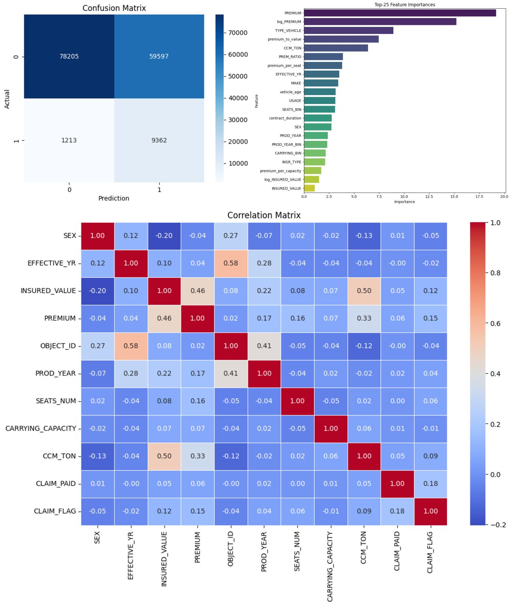

# 🚗📊 InsurAI – Vehicle Insurance Risk Modeling

Hi there! 👋 This repository contains my project for analyzing vehicle insurance data and modeling risk.

---

## 🎯 Project Goals

- **Classification Model** 🧮 → Predict whether a policy will result in a claim (`CLAIM_FLAG`).  
- **Regression Model** 📈 → Estimate the actual claim amount (`CLAIM_PAID`) for policies with claims.  

---

## 🛠 Workflow

1. **EDA & Visualization** 🔍  
   Explore the dataset to identify patterns, risk factors, and distributions.  

2. **Feature Engineering** 🧩  
   - Created new features (ratios, binary flags, log transforms, etc.).  
   - Handled missing values through imputation.  

3. **Modeling** 🤖  
   - Trained **CatBoostClassifier** for claim classification.  
   - Built regression models for claim amount prediction.  

4. **Evaluation** 📊  
   - Metrics: Accuracy, Precision, Recall, F1-score.  
   - Confusion Matrix & ROC Curve for classification.  
   - MAE & RMSE for regression.  

---

## 📂 Project Structure

📁 insurAI/  
┣ 📓 notebook.ipynb ← main notebook for analysis & modeling  
┣ 📁 catboost_info/ ← training logs & CatBoost outputs  
┣ 📄 .gitignore ← ignored files (logs, raw data, etc.)  
┣ 📄 README.md ← this documentation file  

---

## 📌 Current Status

✅ Exploratory Data Analysis (EDA) completed  
✅ Feature engineering implemented  
✅ Classification model (CatBoost) trained and optimized  
✅ Improved recall and F1-score with threshold adjustment (0.05) and class weight balancing  
🚧 Regression model for claim amounts is under development  

---

## ⚠️ Note on Dataset & Model Performance

- Correlation analysis showed that most features had **very weak signal** with the target variables (`CLAIM_FLAG`, `CLAIM_PAID`).  
- Even after extensive feature engineering (ratios, log transforms, binning, vehicle age, frequency encoding, etc.), predictive power remained limited.  
- The classifier could recall more claims after threshold tuning, but precision decreased due to imbalance.  
- The dataset appears better suited for **risk analysis** (e.g., claim trends by production year, insured value ranges) than for high-performance predictive modeling.  

👉 The limitation lies in the dataset itself, not the modeling process. The project demonstrates a structured ML workflow and emphasizes critical evaluation of data quality.  

---

## 📊 Results & Insights

### 🔹 Overall Classification (All Claims)
- **Accuracy:** ~0.59  
- **Precision (claims):** 0.14  
- **Recall (claims):** 0.88  
- **F1-score (claims):** 0.24  
- The model flagged many claims correctly but at the cost of many false positives.  

### 🔹 Large Claims Detection (Main Business Goal)
- **Precision:** 1.00  
- **Recall:** 0.96  
- **F1-score:** 0.98  
- Out of 501 large claims in the test set, the model correctly identified **481**, missing only 20.  
- ✅ This is the key achievement: the model performs **exceptionally well in identifying high-impact, large claims**, even though it struggles on small/noisy ones.  

### 🔹 Feature Importances
- Most influential predictors: `PREMIUM`, `log_PREMIUM`, `TYPE_VEHICLE`, `INSURED_VALUE`, `CCM_TON`.  
- Premium-related variables dominated the signal.  

### 🔹 Correlation Matrix
- Weak direct correlation of most features with claims.  
- Stronger relationships only between financial variables:  
  - `PREMIUM` ↔ `INSURED_VALUE` (0.46)  
  - `EFFECTIVE_YR` ↔ `OBJECT_ID` (0.58)  

## 📊 Results Visualization

Here is a visualization of the model results (Confusion Matrix, Feature Importances, Correlations):

---

## 📌 Key Takeaway
Even if the model improves claim detection by only **2%**, for a large insurer this can mean **millions in savings**.  
The business value comes not from perfect predictions but from **spotting large, high-risk claims** early — which this model achieves with near-perfect precision and recall.  

---

#DataScience #MachineLearning #PredictiveModeling #InsuranceAnalytics #RiskModeling #InsurTech #ActuarialScience
